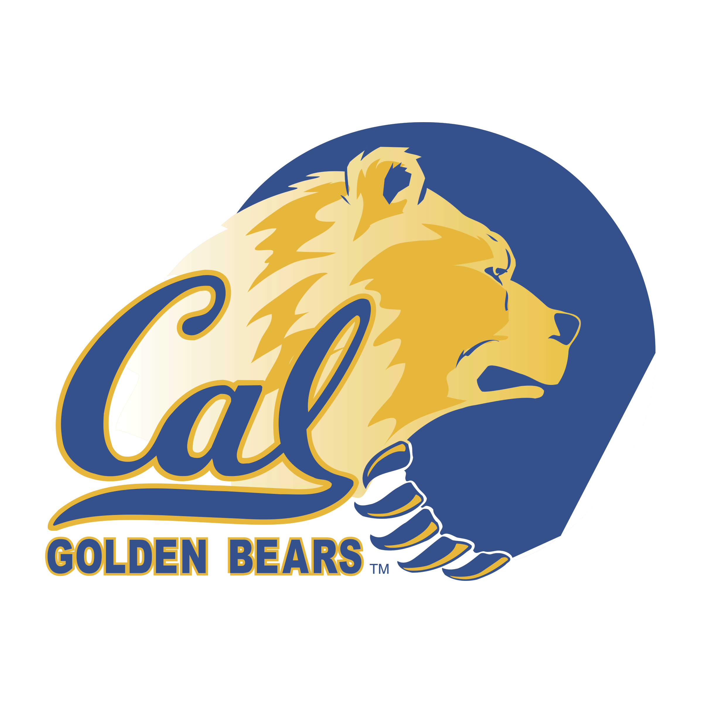

<style>
#title-block-header, .quarto-title-block {
  display: none !important;
}

body {
  background: url('https://www.transparenttextures.com/patterns/cubes.png'), #f0f2f5;
  font-family: 'Inter', system-ui, -apple-system, sans-serif;
  color: #003262;
}

.hero-banner {
  background: linear-gradient(135deg, #003262 0%, #0a4f8f 100%);
  border-radius: 20px;
  padding: 45px 40px;
  margin-top: 20px;
  margin-bottom: 30px;
  color: white;
  display: flex;
  justify-content: center;
  align-items: center;
  position: relative;
  box-shadow: 0 15px 35px rgba(0, 50, 98, 0.2);
}

.hero-text {
  text-align: center;
  display: flex;
  flex-direction: column;
  align-items: center;
  z-index: 2;
  max-width: 700px;
}

.hero-name {
  font-size: 2rem;
  font-weight: 760;
  margin: 0 0 8px 0;
  color: #FDB515;
  letter-spacing: -0.8px;
  line-height: 1.02;
  display: block;
}

.hero-major {
  font-size: 1.08rem;
  margin: 0 0 10px 0;
  font-weight: 600;
  color: #f8fbff;
  line-height: 1.4;
}

.hero-year {
  font-size: 2rem;
  margin: 0;
  font-weight: 900;
  color: #FDB515;
  letter-spacing: -0.4px;
  line-height: 1.05;
}

.hero-logo {
  position: absolute;
  right: 36px;
  max-width: 155px;
  height: auto;
  display: block;
  filter: drop-shadow(0 4px 10px rgba(255,255,255,0.15));
}

.glass-card {
  background: rgba(255, 255, 255, 0.88);
  backdrop-filter: blur(10px);
  -webkit-backdrop-filter: blur(10px);
  border: 1px solid rgba(255, 255, 255, 0.42);
  border-radius: 24px;
  padding: 34px;
  box-shadow: 0 10px 30px rgba(0, 0, 0, 0.05);
}

.photo-card {
  max-width: 420px;
  margin: 0 auto 28px auto;
  display: flex;
  align-items: center;
  justify-content: center;
}

.profile-pic {
  width: 100%;
  border-radius: 18px;
  box-shadow: 0 8px 20px rgba(0,0,0,0.1);
  display: block;
}

.about-card {
  max-width: 1050px;
  margin: 0 auto 28px auto;
}

.about-card h2 {
  margin-top: 0;
  margin-bottom: 14px;
  font-weight: 800;
  color: #003262;
}

.about-card p {
  line-height: 1.82;
  margin-bottom: 16px;
  font-size: 1.03rem;
}

.highlight-quote {
  background: rgba(253, 181, 21, 0.14);
  border-left: 5px solid #FDB515;
  padding: 20px 22px;
  border-radius: 12px;
  margin: 24px 0;
  font-style: italic;
  font-size: 1.08rem;
  line-height: 1.7;
  color: #003262;
}

.btn-grid {
  display: grid;
  grid-template-columns: repeat(3, minmax(210px, 1fr));
  gap: 18px;
  max-width: 860px;
  margin: 28px auto 0 auto;
  justify-content: center;
}

.nav-btn {
  min-height: 86px;
  background: white;
  border: 1px solid #e1e8ed;
  padding: 16px 18px;
  border-radius: 12px;
  text-align: center;
  text-decoration: none !important;
  color: #003262 !important;
  font-weight: 700;
  transition: all 0.3s ease;
  display: flex;
  align-items: center;
  justify-content: center;
  line-height: 1.45;
}

.nav-btn:hover {
  background: #003262;
  color: #FDB515 !important;
  transform: translateY(-3px);
  box-shadow: 0 5px 15px rgba(0,0,0,0.1);
}

.bottom-links {
  text-align: center;
  padding: 20px 0 50px 0;
}

.bottom-links a {
  display: inline-block;
  margin: 0 10px;
  padding: 13px 20px;
  border-radius: 12px;
  background: white;
  border: 1px solid #dbe3ea;
  color: #003262;
  font-weight: 700;
  text-decoration: none;
  transition: all 0.3s ease;
}

.bottom-links a:hover {
  background: #003262;
  color: #FDB515;
  text-decoration: none;
  transform: translateY(-2px);
}

.bottom-links i {
  margin-right: 8px;
}

@media (max-width: 900px) {
  .hero-banner {
    flex-direction: column;
    padding: 35px 20px;
  }

  .hero-logo {
    position: static;
    margin-top: 20px;
    max-width: 135px;
  }

  .hero-name {
    font-size: 2rem;
  }

  .hero-major {
    font-size: 1rem;
  }

  .hero-year {
    font-size: 1.6rem;
  }

  .photo-card,
  .about-card {
    max-width: 100%;
  }

  .btn-grid {
    grid-template-columns: 1fr;
    max-width: 100%;
  }

  .nav-btn {
    min-height: unset;
  }
}
</style>

```{=html}
<div class="hero-banner">
  <div class="hero-text">
    <div class="hero-name">Ajay Sharma</div>
    <div class="hero-major">B.A. Statistics &amp; B.A. Applied Mathematics (Data Science Emphasis)</div>
    <div class="hero-year">UC Berkeley ’25</div>
  </div>
  
</div>

<div class="glass-card photo-card">
  
</div>

<div class="glass-card about-card">
  <h2>About Me</h2>

  <p>I’m Ajay Sharma, a recent UC Berkeley graduate in Statistics and Applied Mathematics (Data Science emphasis) with a strong interest in applying data to drive real-world decisions. My experience spans analytics, operations, and cross-functional problem solving—from building automated data pipelines and conducting structured analyses to supporting decision-making and clear reporting. I enjoy working in fast-paced environments where I can take ambiguous problems, break them down, and turn them into measurable outcomes.</p>

  <p>Alongside my technical work, I’ve led and executed large-scale initiatives, including organizing a 155-participant global hackathon, coordinating teams, and managing end-to-end execution across stakeholders. I’ve also contributed to data-driven projects through internships and independent work, including building tools to automate data collection and improve analysis efficiency. In parallel, I work as a math and computer science instructor and am a published chess book author, experiences that have strengthened my ability to communicate complex ideas in a clear and approachable way.</p>

  <div class="highlight-quote">
    “From large-scale initiatives to personal transformation, I try to approach every challenge with curiosity, discipline, and long-term thinking.”
  </div>

  <p>When I’m not analyzing data, building models, or writing code, I’m working on my second book—a course reader on computational data analysis as a bridge into theoretical machine learning. Outside of work, you’ll often find me at the gym or on the running trail—a big part of my life after losing over 120 pounds (from 285 to 155 lbs)—or simply spending time with friends and family. Whether I’m mentoring students or exploring my next data-driven project, I’m driven by curiosity, collaboration, and a constant desire to improve.</p>

  <p><strong>Go Bears!</strong></p>

  <div class="btn-grid">
    <a href="finance.qmd" class="nav-btn">📈 Finance &amp; Underwriting</a>
    <a href="resume.qmd" class="nav-btn">📄 Resume</a>
    <a href="webapp.qmd" class="nav-btn">💼 Web Applications</a>
    <a href="projects.qmd" class="nav-btn">🧠 Data Science &amp; Software</a>
    <a href="book.qmd" class="nav-btn">📚 Books</a>
    <a href="berkeley-coursework.qmd" class="nav-btn">🎓 Berkeley Coursework</a>
    <a href="contact.qmd" class="nav-btn">✉️ Contact Me</a>
  </div>
</div>

<div class="bottom-links">
  <a href="resume.pdf" target="_blank"><i class="bi bi-file-earmark-person"></i> Resume</a>
  <a href="https://github.com/ajay8005" target="_blank"><i class="bi bi-github"></i> GitHub</a>
  <a href="https://linkedin.com/in/asharma2718" target="_blank"><i class="bi bi-linkedin"></i> LinkedIn</a>
</div>
```
