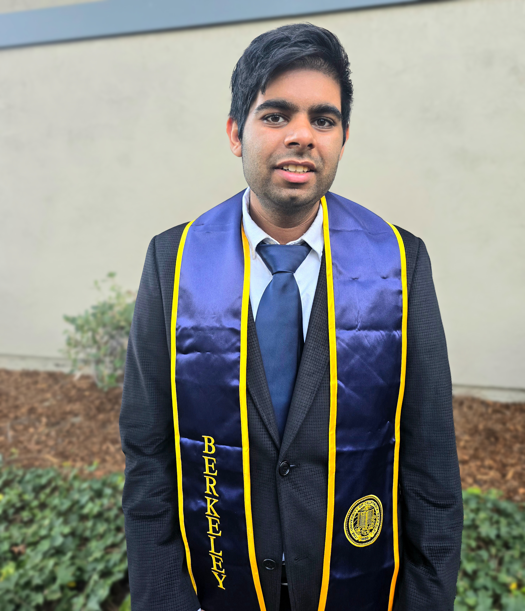

{width=60% .rounded}

## About Me

I’m Ajay Sharma, a recent UC Berkeley graduate in Statistics and Applied Mathematics (Data Science emphasis) with a strong interest in applying data to drive real-world decisions. My experience spans analytics, operations, and cross-functional problem solving—from building automated data pipelines and conducting structured analyses to supporting decision-making and clear reporting. I enjoy working in fast-paced environments where I can take ambiguous problems, break them down, and turn them into measurable outcomes.

Alongside my technical work, I’ve led and executed large-scale initiatives, including organizing a 155-participant global hackathon, coordinating teams, and managing end-to-end execution across stakeholders. I’ve also contributed to data-driven projects through internships and independent work, including building tools to automate data collection and improve analysis efficiency. In parallel, I work as a math and computer science instructor and am a published chess book author, experiences that have strengthened my ability to communicate complex ideas in a clear and approachable way.

When I’m not analyzing data, building models, or writing code, I’m working on my second book—a course reader on computational data analysis as a bridge into theoretical machine learning. Outside of work, you’ll often find me at the gym or on the running trail—a big part of my life after losing over 120 pounds (from 285 to 155 lbs)—or simply spending time with friends and family. Whether I’m mentoring students or exploring my next data-driven project, I’m driven by curiosity, collaboration, and a constant desire to improve. 

Go Bears!

- 🔭 Currently: Research in theoretical statistics, statistical modeling & machine learning, and teaching.
- 📄 [Resume](resume.qmd) 
- 💼 Projects: [Web Applications](webapp.qmd), [Data Science & Software](projects.qmd), [Books](book.qmd)  
- 🎓 [Berkeley Coursework](berkeley-coursework.qmd)  
- ✉️ [Contact Me](contact.qmd)

<footer style="text-align:center; margin-top:3rem; font-size:2rem;">
  <a href="resume.pdf" target="_blank"
     style="margin:0 1rem; text-decoration:none;">
    <i class="bi bi-file-earmark-person" title="Résumé"></i>
  </a>
  <a href="https://github.com/ajay8005" target="_blank"
     style="margin:0 1rem; text-decoration:none;">
    <i class="bi bi-github" title="GitHub"></i>
  </a>
  <a href="https://linkedin.com/in/asharma2718" target="_blank"
     style="margin:0 1rem; text-decoration:none;">
    <i class="bi bi-linkedin" title="LinkedIn"></i>
  </a>
</footer>